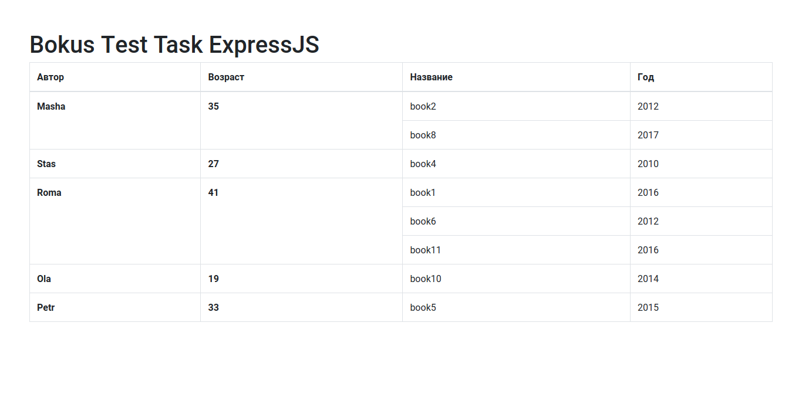

# Bokus Test Task ExpressJS
## Usage
Start in prod mode
```
npm start 
```
Start in dev mode
```
npm run dev
```
Start in dev mode with file change monitor
```
npm run watch:dev 
```
## Screenshot

